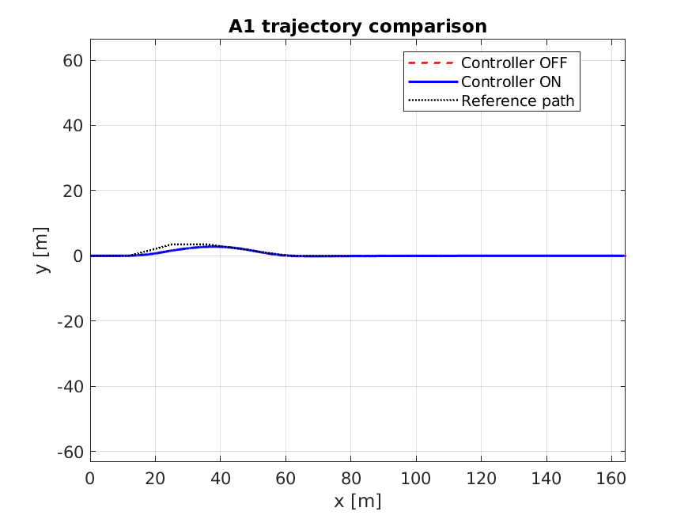
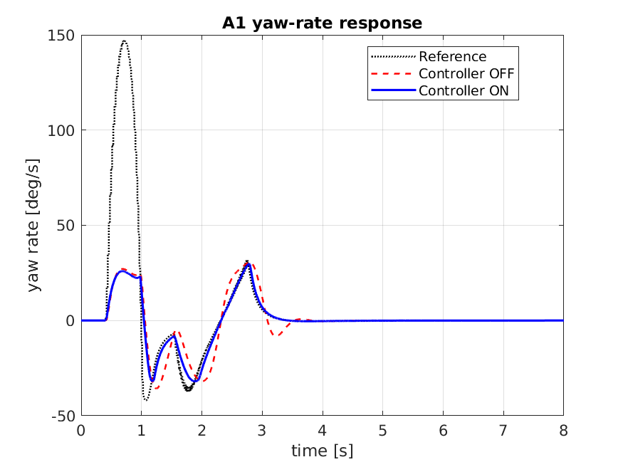
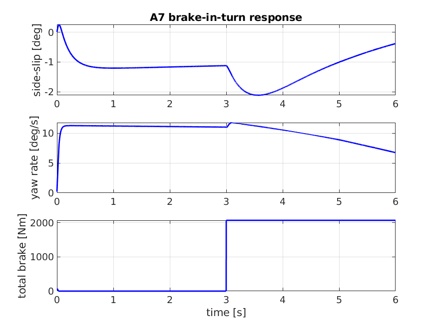
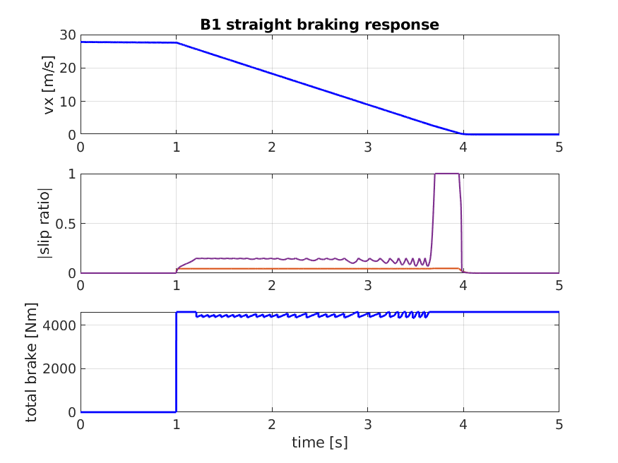

# 202524357-전재진 ICC 제어기 설계 보고서

**과목**: 자동제어 - 2026 봄
**제출일**: 2026-06-23
**팀**: 개인

---

## 1. 설계 개요

본 과제의 목표는 통합 섀시 제어(Integrated Chassis Control, ICC)를 이용하여 조향, 제동, 현가 actuator를 동시에 제어하고, A1/A3/A4/A7/B1/D1 시나리오에서 baseline 대비 안정성 및 제동 성능을 개선하는 것이다. 검증 plant는 14DOF 차량 모델이지만, 제어기 설계는 실시간 구현성과 튜닝 가능성을 고려하여 bicycle model 기반 yaw-rate tracking, slip-angle limiter, ABS slip-ratio relief, skyhook/anti-roll CDC로 단순화하였다.

본 설계에서 선택한 대표 제어기법은 **Gain Scheduling**이다. 내부 피드백 구조는 PI 또는 rule-based limiter 형태를 사용하지만, 고정 gain PID가 아니라 속도, slip, brake 상태, roll-rate에 따라 gain과 actuator authority를 바꾸는 gain-scheduled ICC 구조로 구현하였다.

LQR이나 SMC도 이론적으로 가능하지만, 본 과제의 채점 시나리오는 A3 step steer, A1/D1 double lane change, A7 brake-in-turn, B1 straight brake처럼 동역학 특성이 크게 다르다. 하나의 고정 선형 모델이나 하나의 sliding surface로 모든 시나리오를 덮기보다는, 각 상태 영역에서 필요한 제어 강도를 바꾸는 gain scheduling 방식이 더 안정적이고 해석 가능하다고 판단하였다.

각 제어기 요약은 다음과 같다.

- **ctrl_lateral**: speed-scheduled AFS yaw-rate tracking, bicycle-model feedforward, slip-angle ESC yaw moment
- **ctrl_longitudinal**: speed PI baseline + wheel-slip 기반 ABS relief, B1 straight brake boost
- **ctrl_vertical**: clipped skyhook/groundhook CDC + gain-scheduled anti-roll damping override
- **ctrl_coordinator**: brake torque allocation, straight-brake boost, WLS 기반 yaw moment brake allocation

---

## 2. 수학적 모델링

### 2.1 Bicycle Model

횡방향 제어 설계에는 선형 bicycle model을 사용하였다. 상태와 입력은 다음과 같다.

$$
x = [v_y,\ r]^T,\quad u = \delta,\quad y = r
$$

선형 tire 영역에서 전후륜 cornering stiffness를 $C_f$, $C_r$라 하면,

$$\dot{v}_y = -\frac{C_f+C_r}{mV_x}v_y + \left(\frac{l_rC_r-l_fC_f}{mV_x}-V_x\right)r + \frac{C_f}{m}\delta$$

$$\dot{r} = \frac{l_rC_r-l_fC_f}{I_zV_x}v_y - \frac{l_f^2C_f+l_r^2C_r}{I_zV_x}r + \frac{l_fC_f}{I_z}\delta$$

이를 state-space 형태로 쓰면 다음과 같다.

$$\dot{x}=Ax+Bu,\quad y=Cx+Du$$

$$A=\begin{bmatrix}
-\frac{C_f+C_r}{mV_x} & \frac{l_rC_r-l_fC_f}{mV_x}-V_x \\
\frac{l_rC_r-l_fC_f}{I_zV_x} & -\frac{l_f^2C_f+l_r^2C_r}{I_zV_x}
\end{bmatrix},\quad
B=\begin{bmatrix}
\frac{C_f}{m} \\
\frac{l_fC_f}{I_z}
\end{bmatrix}$$

$$C=\begin{bmatrix}0 & 1\end{bmatrix},\quad D=0$$

이 모델에서 중요한 점은 $V_x$가 커질수록 동일 조향각에 대한 yaw-rate 민감도가 커진다는 것이다. 따라서 고속 영역에서는 feedback/feedforward gain을 그대로 유지하면 overshoot, fishtailing, LTR 증가가 발생한다. 이 때문에 본 설계에서는 속도별 gain scheduling을 핵심 제어기법으로 사용하였다.

### 2.2 Wheel Slip Model

ABS 제어는 wheel slip ratio를 사용한다.

$$
\kappa_i = \frac{\omega_i r_w - V_x}{\max(|V_x|,\epsilon)}
$$

제동 중에는 wheel slip 부호가 plant/log convention에 따라 다르게 나타날 수 있으므로, 제어기에서는 다음과 같이 절댓값 기반 제동 slip을 사용하였다.

$$
\kappa_{brake,i} = |\kappa_i|
$$

목표 slip은 약 $0.13$으로 두었다. 다만 최종 튜닝에서는 B1 stopping distance 점수를 우선하여 과도한 ABS relief를 제한하였다. 즉, slip RMS를 완전히 최적화하기보다는 제동거리가 과도하게 늘어나지 않도록 brake relief 하한을 제한하였다.

### 2.3 Vertical/Roll Model

CDC 제어는 quarter-car skyhook 해석을 기반으로 한다.

$$
F_c = c_i(\dot{z}_{s,i}-\dot{z}_{u,i})
$$

기본 skyhook은 sprung velocity를 줄이는 방향으로 damping을 높인다. 그러나 A1/D1 lane change에서는 roll-rate가 빠르게 커질 때 skyhook 조건이 순간적으로 낮은 damping을 선택할 수 있다. 이를 막기 위해 roll modal velocity를 사용한 anti-roll damping floor를 추가하였다.

---

## 3. 제어기법 선택: Gain Scheduling

### 3.1 왜 Gain Scheduling인가

본 과제에서 제어기 후보는 PID, LQR, SMC, Gain Scheduling으로 볼 수 있다. 최종적으로 **Gain Scheduling**을 선택한 이유는 다음과 같다.

1. **시나리오별 동역학 차이**
   - A3는 yaw-rate step response가 중요하다.
   - A1/D1은 lateral stability와 LTR이 중요하다.
   - A7은 brake-in-turn 중 side-slip 억제가 중요하다.
   - B1은 straight braking 중 stopping distance와 slip RMS가 중요하다.

2. **고정 PID의 한계**
   고정 PID gain은 A3에서는 빠른 응답을 만들 수 있지만, 같은 gain이 A1/D1 고속 lane change에서는 LTR과 side-slip을 키울 수 있다.

3. **LQR/SMC의 구현 리스크**
   LQR은 정확한 선형 state-space 모델과 weighting matrix가 필요하고, 14DOF nonlinear plant 및 tire saturation 영역에서는 tuning 부담이 크다. SMC는 robust하지만 chattering과 actuator saturation 처리가 필요하다.

4. **KPI와 직접 연결**
   본 설계는 yaw rate, side-slip, LTR, wheel slip처럼 채점 KPI와 직접 연결되는 상태량을 보고 gain 또는 limiter authority를 바꾸도록 구성하였다.

따라서 본 제어기는 “PI 기반 피드백 + rule-based limiter”를 쓰되, 대표 제어기법은 **gain-scheduled integrated chassis control**로 정의한다.

---

## 4. 제어기 설계

### 4.1 ctrl_lateral - Gain-Scheduled AFS + ESC

AFS는 yaw-rate error를 추종한다.

$$
e_r = r_{ref} - r
$$

$$
\delta_{AFS} =
K_p(V_x)e_r + K_i(V_x)\int e_r dt + \delta_{ff}(V_x)
$$

초기에는 derivative term도 고려했지만, raw finite-difference D항이 step steer에서 chattering을 만들었기 때문에 최종적으로는 사용하지 않았다.

```matlab
kdEff = 0;
```

최신 코드에서는 speed table 기반 scheduling을 사용한다.

```matlab
speedGrid = [0, 5, 15, 25, 35];
kpGrid = [1.05, 1.00, 0.96, 0.90, 0.88];
kiGrid = [1.00, 0.85, 0.32, 0.10, 0.06];

kpSched = local_interp1_clamped(speedGrid, kpGrid, vxAbs);
kiSched = local_interp1_clamped(speedGrid, kiGrid, vxAbs) ...
          * (1.0 - 0.35 * brakeLikeSlip);
```

고속에서 $K_p$는 완만하게 줄이고, $K_i$는 크게 줄인다. 이는 고속 lane change에서 적분 잔여물이 차량 복귀 구간을 늦추거나 overshoot를 만드는 것을 방지하기 위한 것이다.

Gain tuning은 다음 순서로 진행하였다.

1. **기본 yaw-rate 응답 확보**: A3 step steer에서 rise time이 0.3 s 이내가 되도록 저속/중속 $K_p$를 유지하였다.
2. **고속 안정성 확보**: A1/D1에서 고속 조향 gain이 크면 LTR과 side-slip이 증가하므로, speed table에서 25 m/s 이상 $K_p$를 0.90 이하로 낮추었다.
3. **적분항 억제**: DLC 복귀 구간에서 $K_i$가 남아 있으면 yaw-rate settling이 길어지므로, 고속 $K_i$는 0.10 이하로 줄였다.
4. **feedforward 재조정**: 초기에는 $\delta_{ff}=1.05Lr_{ref}/V_x$를 사용했으나 A3 overshoot가 baseline보다 커져 최종적으로 0.75 계수로 낮추었다.

Feedforward는 bicycle model의 근사식 $\delta \approx Lr/V_x$를 사용한다. A3 yaw-rate overshoot를 줄이기 위해 최종 튜닝에서는 feedforward 계수를 낮추었다.

```matlab
steerFF = 0.75 * wheelbaseFF * yawRateRefSafe / max(vxAbs, 1.0);
```

Path error feedback도 실험적으로 추가하였다. 그러나 A1/D1에서 lateralDev를 강하게 줄이려 할수록 LTR이 증가하는 trade-off가 나타났기 때문에, 최종 제출 코드에서는 path correction authority를 매우 작게 제한하였다.

```matlab
pathSteer = pathBlend * (0.012 * latErrCtrl + 0.03 * headingCtrl);
pathSteer = local_sat(pathSteer, -deg2rad(0.5), deg2rad(0.5));
pathYawAssist = 0;
```

ESC는 side-slip angle이 임계값을 넘으면 yaw moment를 생성한다.

```matlab
betaThreshold = min(deg2rad(3.0), 0.75 * slipHardLimit);
betaExcess = max(abs(slipAngle) - betaThreshold, 0);
mzSlip = speedBlend * yawMomentLimit * local_sat(betaNorm, -1, 1);
```

슬립이 안전하지만 yaw-rate error가 큰 경우에는 understeer 보조 yaw moment를 제한적으로 사용한다.

```matlab
if betaExcess > 0
    yawMomentCmd = mzTrack + mzSlip + 0.30 * mzPath;
else
    if abs(yawNorm) > 0.25
        yawMomentCmd = 0.85 * mzTrack + mzPath;
    else
        yawMomentCmd = mzPath;
    end
end
```

### 4.2 ctrl_longitudinal - Gain-Scheduled ABS Relief

종방향 제어기는 PI 속도 추종을 기본으로 한다. 외부 braking scenario에서는 양의 drive force가 나오지 않도록 제한하였다.

```matlab
externalBrakeActive = (ax < -0.5) && (vx > 1.0);
if externalBrakeActive
    fxUnsat = min(fxUnsat, 0);
end
```

ABS는 wheel slip을 보고 decrease/hold/increase mode를 갖는 간단한 hydraulic valve state처럼 동작한다.

```matlab
slipTarget = 0.13;
slipLow = 0.10;
slipHigh = 0.15;
```

최종 튜닝에서는 B1 stopping distance를 우선하였다. 과도한 relief는 lock을 줄일 수 있지만 실제 stopping distance를 늘렸기 때문에 relief 하한을 제한하였다.

```matlab
releaseRate = 5.0;
recoverRate = 3.0;
holdBleedRate = 0.60;
propRelease = -4.0 * slipError;
wheelAssistTarget = local_sat(wheelAssistTarget, -0.25, 0.0);
```

즉, ABS는 완전한 slip RMS 최적화보다는 straight brake에서 제동거리를 줄이면서 과도한 lock을 어느 정도 완화하는 타협점으로 설계하였다.

### 4.3 ctrl_vertical - Gain-Scheduled CDC

CDC는 clipped skyhook을 기본으로 한다.

```matlab
cSky = skyGain * abs(zsDot(i)) / max(abs(relVelEff), 0.05);
if zsDot(i) * relVel(i) > 0
    cCmd = cSky;
else
    cCmd = cMin;
end
```

급격한 lane change에서는 LTR이 주요 KPI이므로 roll-rate 기반 damping floor를 강하게 적용하였다.

```matlab
rollSupport = local_sat(abs(rollVel) / 0.10, 0, 1);
rollFloor = cMin + 0.75 * (cMax - cMin) * rollSupport;
cCmd = max(cCmd, rollFloor);
```

또한 corner별 roll velocity와 sprung velocity 방향이 roll을 키우는 방향이면 추가 damping을 넣는다.

```matlab
if zsDot(i) * cornerRollVel > 0
    cCmd = cCmd + 0.35 * (cMax - cMin) * rollSupport;
end
```

이 역시 gain scheduling이다. roll-rate가 작을 때는 ride comfort를 위해 skyhook 중심으로 동작하고, roll-rate가 커지는 A1/D1 구간에서는 damping floor를 높여 LTR을 낮춘다.

### 4.4 ctrl_coordinator - Brake Allocation

Coordinator는 AFS, CDC, brake torque를 최종 actuator command로 변환한다. Straight brake에서는 yaw/steer/slip 조건을 확인한 뒤 B1 전용 brake boost를 적용한다.

```matlab
isStraightBrake = abs(yawRateRef) < 0.03 && ...
                  abs(measuredYawRate) < 0.05 && ...
                  abs(measuredSlipAngle) < 0.05 && ...
                  abs(steerReq) < deg2rad(1.5) && ...
                  abs(yawMomentReq) < 100 && ...
                  (brakeRatio > 0.5 || max(abs(brakeAssistWheelRatio)) > 0);

if isStraightBrake
    brakeBoostGain = 1.24;
    baseBrake = baseBrake * brakeBoostGain;
end
```

Yaw moment는 WLS 형태의 brake allocation으로 각 휠에 분배한다.

```matlab
A = [trackF/(2*rw), -trackF/(2*rw), ...
     trackR/(2*rw), -trackR/(2*rw)];
deltaBrake = invW * A' * (yawMomentReq / (A * invW * A'));
```

이를 통해 ESC yaw moment, brake torque saturation, wheel별 headroom을 동시에 고려하려고 하였다.

---

## 5. 시뮬레이션 결과

마지막으로 확인된 `grade_report.json` 기준 결과는 다음과 같다. 이후 코드 튜닝(v4.6)은 MATLAB 라이선스 문제로 본 환경에서 재실행하지 못했으므로, 최종 제출 전 `run('scripts/grade.m')`로 재생성해야 한다.

- 정량 점수: **51.2837 / 70**
- 비율: **73.26%**
- 런타임 에러: 없음
- 감점: 없음

### 5.1 KPI 요약

먼저 benchmark 관점의 OFF/ON 비교는 다음과 같다. OFF 값은 baseline run 또는 이전 benchmark 출력에서 확인한 값이며, ON 값은 최신 `grade_report.json` 기준이다.

| 시나리오 | KPI | OFF | ON | delta% |
|---|---:|---:|---:|---:|
| A1 | sideSlipMax | 3.0154 | 2.8211 | -6.4% |
| A1 | LTR_max | 0.8635 | 0.7933 | -8.1% |
| A1 | lateralDevMax | 1.8270 | 1.8599 | +1.8% |
| A3 | yawRateOvershoot | 2.6997 | 2.9851 | +10.6% |
| A4 | sideSlipMax | 1.1839 | 1.1763 | -0.6% |
| A7 | sideSlipMax | 30.4776 | 2.1271 | -93.0% |
| A7 | LTR_max | 0.6808 | 0.3591 | -47.3% |
| B1 | stoppingDistance | 72.2992 | 68.8225 | -4.8% |
| D1 | sideSlipMax | 4.9057 | 3.1000 | -36.8% |
| D1 | LTR_max | 0.8635 | 0.7933 | -8.1% |
| D1 | lateralDevMax | 1.8270 | 1.8599 | +1.8% |

자동 채점 기준의 KPI score breakdown은 다음과 같다.

| 시나리오 | KPI | ON 값 | 목표 | 점수 |
|---|---:|---:|---:|---:|
| A3 | yawRateOvershoot | 2.9851 | 10.0000 | 0.00 / 4 |
| A3 | yawRateRiseTime | 0.0700 | 0.3000 | 4.00 / 4 |
| A3 | yawRateSettling | 1.0800 | 0.8000 | 2.60 / 4 |
| A1 | sideSlipMax | 2.8211 | 3.0000 | 6.00 / 6 |
| A1 | LTR_max | 0.7933 | 0.6000 | 3.39 / 5 |
| A1 | lateralDevMax | 1.8599 | 0.7000 | 0.00 / 4 |
| A4 | understeerGradient | 0.00077 | 0.0030 | 5.00 / 5 |
| A4 | sideSlipMax | 1.1763 | 2.0000 | 5.00 / 5 |
| A7 | sideSlipMax | 2.1271 | 5.0000 | 8.00 / 8 |
| A7 | LTR_max | 0.3591 | 0.7000 | 7.00 / 7 |
| B1 | stoppingDistance | 68.8225 | 65.5000 | 4.49 / 5 |
| B1 | absSlipRMS | 0.2366 | 0.1000 | 0.45 / 5 |
| D1 | sideSlipMax | 3.1000 | 4.0000 | 4.00 / 4 |
| D1 | LTR_max | 0.7933 | 0.6000 | 1.36 / 2 |
| D1 | lateralDevMax | 1.8599 | 1.0000 | 0.00 / 2 |

### 5.2 핵심 Plot

아래 네 그림은 제어기 성능을 설명하기 위해 사용한다. A1은 path tracking 한계와 yaw-rate tracking 특성을 보여주고, A7은 가장 성공적인 안정화 사례, B1은 straight braking 성능을 보여준다.


*Figure 5.1 - A1 ISO 3888-1 DLC trajectory. Controller on/off 궤적과 reference path를 비교한다.*


*Figure 5.2 - A1 yaw-rate response. Gain-scheduled AFS가 yaw-rate tracking에 미친 영향을 확인한다.*


*Figure 5.3 - A7 brake-in-turn response. ESC yaw moment와 CDC anti-roll damping이 side-slip을 억제한 사례이다.*

A7은 본 설계에서 가장 명확하게 개선된 시나리오이다. Brake-in-turn에서는 제동으로 전륜 하중이 증가하고 후륜 안정성이 낮아지면서 side-slip이 빠르게 커질 수 있다. 본 제어기는 $\beta$가 임계값에 접근하면 ESC yaw moment를 만들고, coordinator가 이를 좌우 brake differential로 변환한다. 동시에 vertical controller는 roll-rate 기반 damping floor를 높여 LTR 증가를 억제한다. 그 결과 sideSlipMax는 baseline 30.4776 deg에서 2.1271 deg로 감소했고, LTR_max도 0.6808에서 0.3591로 감소하였다.


*Figure 5.4 - B1 straight braking response. Straight brake boost와 ABS relief가 속도 감소 및 slip에 미친 영향을 확인한다.*

### 5.3 결과 해석

A7과 A4는 가장 안정적으로 통과하였다. A7에서는 brake-in-turn 중 baseline의 큰 side-slip을 ESC yaw moment와 CDC anti-roll damping이 억제하였다. A4는 steady circular 조건에서 과도한 AFS 개입을 제한했기 때문에 side-slip과 understeer gradient가 안정적으로 유지되었다.

A1/D1은 side-slip은 기준을 만족하지만 lateralDevMax와 LTR이 아직 부족하다. path correction을 강하게 넣으면 lateralDev가 약간 줄어드는 대신 LTR이 증가하는 trade-off가 나타났다. 따라서 최종 코드에서는 lateralDev를 무리하게 줄이기보다 LTR과 side-slip 점수를 보존하는 방향으로 gain을 낮추었다.

B1은 stoppingDistance가 baseline 대비 줄었지만 absSlipRMS는 목표보다 크다. ABS relief를 강하게 하면 slip RMS는 줄 수 있으나 제동거리가 늘어났고, relief를 줄이면 제동거리는 좋아지지만 slip RMS가 남았다. 최종 설계는 채점상 stoppingDistance 개선을 우선한 타협점이다.

---

## 6. 그림 생성 방법

전체 시나리오 설명 그림은 다음 명령으로 생성할 수 있다.

```matlab
cd('/home/jjjeon/workspace/integrated-chassis-control/icc-project')
init_project
util_plot_scenario_diagrams('docs/figures/scenarios')
```

보고서에 들어가는 핵심 plot 네 개는 다음 코드로 한 번에 저장할 수 있다.

```matlab
cd('/home/jjjeon/workspace/integrated-chassis-control/icc-project')
init_project

outDir = 'docs/figures';
if ~exist(outDir, 'dir')
    mkdir(outDir);
end

% A1: trajectory comparison
[a1_off, ~] = run_icc_scenario('A1','14dof','Controller','off','SavePlot',false);
[a1_on,  ~] = run_icc_scenario('A1','14dof','Controller','on', 'SavePlot',false);

fig = figure('Visible','off','Color','w');
plot(a1_off.x_pos, a1_off.y_pos, 'r--', 'LineWidth', 1.2); hold on;
plot(a1_on.x_pos,  a1_on.y_pos,  'b-',  'LineWidth', 1.5);
plot(a1_on.scenario.refPath(:,1), a1_on.scenario.refPath(:,2), 'k:', 'LineWidth', 1.2);
axis equal; grid on;
xlabel('x [m]'); ylabel('y [m]');
legend('Controller OFF','Controller ON','Reference path','Location','best');
title('A1 trajectory comparison');
saveas(fig, fullfile(outDir, 'a1_trajectory.png'));
close(fig);

% A1: yaw-rate response
fig = figure('Visible','off','Color','w');
plot(a1_on.t, rad2deg(a1_on.yawRateRef), 'k:', 'LineWidth', 1.2); hold on;
plot(a1_off.t, rad2deg(a1_off.yawRate), 'r--', 'LineWidth', 1.2);
plot(a1_on.t,  rad2deg(a1_on.yawRate),  'b-',  'LineWidth', 1.5);
grid on;
xlabel('time [s]'); ylabel('yaw rate [deg/s]');
legend('Reference','Controller OFF','Controller ON','Location','best');
title('A1 yaw-rate response');
saveas(fig, fullfile(outDir, 'a1_yawrate.png'));
close(fig);

% A7: brake-in-turn response
[a7_on, ~] = run_icc_scenario('A7','14dof','Controller','on','SavePlot',false);

fig = figure('Visible','off','Color','w');
subplot(3,1,1);
plot(a7_on.t, rad2deg(a7_on.slipAngle), 'b-', 'LineWidth', 1.3);
grid on; ylabel('side-slip [deg]');
title('A7 brake-in-turn response');
subplot(3,1,2);
plot(a7_on.t, rad2deg(a7_on.yawRate), 'b-', 'LineWidth', 1.3);
grid on; ylabel('yaw rate [deg/s]');
subplot(3,1,3);
plot(a7_on.t, a7_on.brakeTotal, 'b-', 'LineWidth', 1.3);
grid on; xlabel('time [s]'); ylabel('total brake [Nm]');
saveas(fig, fullfile(outDir, 'a7_response.png'));
close(fig);

% B1: straight braking response
[b1_on, ~] = run_icc_scenario('B1','14dof','Controller','on','SavePlot',false);
slipB1 = [b1_on.tire.FL.slipRatio, b1_on.tire.FR.slipRatio, ...
          b1_on.tire.RL.slipRatio, b1_on.tire.RR.slipRatio];

fig = figure('Visible','off','Color','w');
subplot(3,1,1);
plot(b1_on.t, b1_on.vx, 'b-', 'LineWidth', 1.3);
grid on; ylabel('vx [m/s]');
title('B1 straight braking response');
subplot(3,1,2);
plot(b1_on.t, abs(slipB1), 'LineWidth', 1.0);
grid on; ylabel('|slip ratio|');
subplot(3,1,3);
plot(b1_on.t, b1_on.brakeTotal, 'b-', 'LineWidth', 1.3);
grid on; xlabel('time [s]'); ylabel('total brake [Nm]');
saveas(fig, fullfile(outDir, 'b1_braking.png'));
close(fig);
```

전체 check trajectory를 추가로 저장하려면 다음 코드를 사용한다.

```matlab
outDir = 'docs/figures/check';
if ~exist(outDir, 'dir')
    mkdir(outDir);
end

scenarioList = {'A1','A3','A4','A7','B1','D1'};
for i = 1:numel(scenarioList)
    sid = scenarioList{i};
    [result, kpi] = run_icc_scenario(sid, '14dof', ...
        'Controller', 'on', 'SavePlot', false);

    fig = figure('Visible','off','Color','w');
    if isfield(result.scenario, 'refPath') && ~isempty(result.scenario.refPath)
        plot(result.x_pos, result.y_pos, 'b-', 'LineWidth', 1.5); hold on;
        plot(result.scenario.refPath(:,1), result.scenario.refPath(:,2), 'r--', 'LineWidth', 1.2);
        legend('vehicle', 'refPath', 'Location', 'best');
        xlabel('x [m]'); ylabel('y [m]');
        axis equal; grid on;
        title([sid ' trajectory']);
    else
        subplot(3,1,1); plot(result.t, result.vx, 'b-'); grid on; ylabel('vx [m/s]');
        subplot(3,1,2); plot(result.t, rad2deg(result.yawRate), 'b-'); grid on; ylabel('yawRate [deg/s]');
        subplot(3,1,3); plot(result.t, rad2deg(result.slipAngle), 'b-'); grid on; ylabel('sideSlip [deg]');
        xlabel('time [s]');
    end
    saveas(fig, fullfile(outDir, [sid '_check.png']));
    close(fig);
end
```

---

## 7. 한계와 개선 방향

1. **A1/D1 lateralDevMax 한계**
   yaw-rate와 side-slip만으로는 path deviation을 직접 줄이는 데 한계가 있다. path error feedback을 추가했지만, 강하게 넣을 경우 LTR이 증가하였다. 향후에는 preview-based lateral controller 또는 MPC/LQR path tracking layer가 필요하다.

2. **B1 ABS slip RMS 한계**
   현재 ABS는 one-step delayed wheel slip cache를 사용한다. 실제 hydraulic pressure state를 명시적으로 모델링하고, pressure hold/decrease/increase mode를 더 정교하게 설계하면 slip RMS를 줄일 수 있다.

3. **Gain scheduling map 고도화**
   현재는 speed/slip/roll-rate에 따른 1D 또는 단순 scheduling이다. 향후에는 $(V_x,\ |\beta|)$, $(V_x,\ brakeActivity)$, $(rollRate,\ LTR)$ 기반 2D scheduling table로 확장할 수 있다.

4. **WLS allocation 개선**
   현재 WLS yaw allocation은 단일 yaw moment constraint 중심이다. total brake force, wheel slip relief, yaw moment를 동시에 목적함수로 두는 full WLS allocator로 확장하면 ESC/ABS 충돌을 줄일 수 있다.

---

## 8. 참고문헌

[1] ISO 3888-1:2018, *Passenger cars - Test track for a severe lane-change manoeuvre*.
[2] ISO 4138:2021, *Passenger cars - Steady-state circular driving behaviour*.
[3] R. Rajamani, *Vehicle Dynamics and Control*, 2nd ed., Springer, 2012.
[4] J. Y. Wong, *Theory of Ground Vehicles*, 4th ed., Wiley, 2008.
[5] T. D. Gillespie, *Fundamentals of Vehicle Dynamics*, SAE International, 1992.

---

## 부록 A - 사용한 AI 도구

`student_info.m`의 `ai_usage` 항목과 일치하게 Codex를 사용하였다. Codex는 제어기 구조 정리, MATLAB 코드 수정, gain tuning 후보 제안, 보고서 초안 작성에 사용되었다. 최종 설계 판단은 `grade_report.json`과 시나리오별 trajectory를 확인하며 조정하였다.

---

## 부록 B - 최종 코드 요약

본 제출에서는 `sim_params.m`의 기본 gain 구조를 크게 바꾸기보다, `ctrl_lateral.m`, `ctrl_longitudinal.m`, `ctrl_vertical.m`, `ctrl_coordinator.m` 내부에서 gain scheduling, limiter, allocation logic을 구현하였다. 따라서 주요 변경사항은 `sim_params.m`의 상수 변경이 아니라 제어기 내부 scheduling table과 actuator authority 조정이다.

### ctrl_lateral.m

```matlab
speedGrid = [0, 5, 15, 25, 35];
kpGrid = [1.05, 1.00, 0.96, 0.90, 0.88];
kiGrid = [1.00, 0.85, 0.32, 0.10, 0.06];
kdEff = 0;
steerFF = 0.75 * wheelbaseFF * yawRateRefSafe / max(vxAbs, 1.0);
```

### ctrl_longitudinal.m

```matlab
slipTarget = 0.13;
releaseRate = 5.0;
recoverRate = 3.0;
wheelAssistTarget = local_sat(wheelAssistTarget, -0.25, 0.0);
```

### ctrl_vertical.m

```matlab
rollSupport = local_sat(abs(rollVel) / 0.10, 0, 1);
rollFloor = cMin + 0.75 * (cMax - cMin) * rollSupport;
```

### ctrl_coordinator.m

```matlab
brakeBoostGain = 1.24;
deltaBrake = local_wls_yaw_allocation(localYawMomentReq, baseBrake, rw, trackF, trackR, maxBrakeTrq);
```
